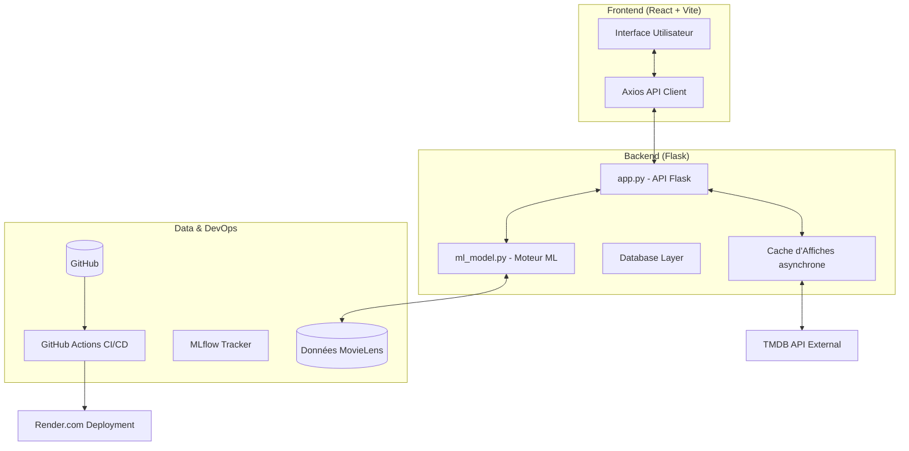

# 🎬 MyTflix - Système de Recommandation de Films

Ce document explique en détail l'architecture, les technologies et les algorithmes utilisés dans cette application.

---

## 🏗️ Architecture Globale

L'application suit une architecture moderne de type **Full-Stack Découplée** :

---

## 🤖 Intelligence Artificielle (Machine Learning)

Le moteur de recommandation (`ml_model.py`) utilise deux approches principales :

### 1. Filtrage Collaboratif (Collaborative Filtering)
- **Concept** : "Les utilisateurs qui aiment les mêmes films que vous aiment aussi..."
- **Technique** : Matrice Utilisateur-Film (User-Item Matrix).
- **Algorithme** : **Cosine Similarity**. On calcule l'angle entre les vecteurs de notation de deux utilisateurs. Plus l'angle est petit (proche de 1), plus les goûts sont similaires.

### 2. Filtrage Basé sur le Contenu (Content-Based)
- **Concept** : "Si vous avez aimé 'Toy Story', vous aimerez d'autres films d'animation/aventure."
- **Technique** : **TF-IDF** (Term Frequency-Inverse Document Frequency).
- **Algorithme** : On transforme les genres (ex: "action|aventure") en vecteurs numériques, puis on calcule la **Cosine Similarity** entre le film sélectionné et le reste du catalogue.

> [!NOTE]
> **Optimisation Mémoire** : Pour fonctionner sur le plan gratuit de Render (512Mo RAM), nous avons remplacé le pré-calcul d'une matrice géante (800Mo) par un **calcul à la volée**. Cela réduit l'empreinte mémoire de 99%.

---

## 📊 Expérimentation avec MLflow

Nous avons intégré **MLflow** pour suivre les performances de nos modèles :
- **Logging** : Chaque entraînement enregistre les hyperparamètres (nombre de recommandations, métriques de similarité).
- **Classe `MLflowExperimentTracker`** : Un wrapper personnalisé qui simplifie l'enregistrement des sessions sans polluer le code principal.
- **Utilité** : Permet de comparer visuellement quelle version de l'algorithme donne les meilleures recommandations au fil du temps.

---

## 🚀 DevOps & CI/CD (L'automatisation)

Nous utilisons **GitHub Actions** pour garantir que le code fonctionne toujours avant d'être mis en ligne.

1. **Frontend CI** :
   - Vérifie la syntaxe (Lint).
   - Compile le projet (Build).
   - Utilise **Node.js 20** pour des performances optimales.
2. **Backend CI** :
   - Lance des tests automatiques sur plusieurs versions de Python (3.9, 3.10, 3.11).
   - Vérifie les failles de sécurité dans les dépendances (Bandit & Safety).
3. **Déploiement Automatique** :
   - Une fois que tous les tests passent ✅, GitHub prévient **Render.com** de mettre à jour l'application en ligne.

---

## 📋 Résumé des Technologies

| Domaine | Technologie |
| :--- | :--- |
| **Frontend** | React, Vite, TailwindCSS (ou Vanilla), Lucide Icons |
| **Backend** | Python, Flask, Gunicorn |
| **ML Engine** | Pandas, Scikit-Learn (TF-IDF, Cosine Similarity) |
| **Database** | PostgreSQL + CSV (MovieLens dataset) |
| **ML Ops** | MLflow |
| **CI/CD** | GitHub Actions |
| **Hébergement** | Render.com (Web Service & Static Site) |

---

## 🛠️ Comment ça tourne ?
1. Le **Frontend** demande des recommandations à l'**API Flask**.
2. Le **Backend** charge le modèle ML optimisé en mémoire.
3. Si une affiche n'est pas en cache, le backend appelle **TMDB** de manière asynchrone pour ne pas ralentir l'utilisateur.
4. L'utilisateur reçoit une interface fluide avec des recommandations personnalisées et des visuels de haute qualité.
